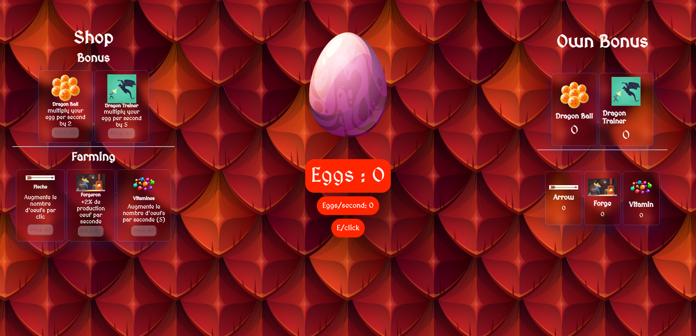

# Dragon Clicker 🐉

- Description courte de projet (140words max)

## Screen live Version

## Live version

[Live Version](https://justindr96.github.io/dragon_clicker/)

## Technologies Utilisées

Ce projet est construit en utilisant les technologies suivantes :

- HTML
- SASS
- JavaScript
- Vite.js

## Développement

- npm install
- npm install sass
- npm run dev

Copyright - 10/11/2023
