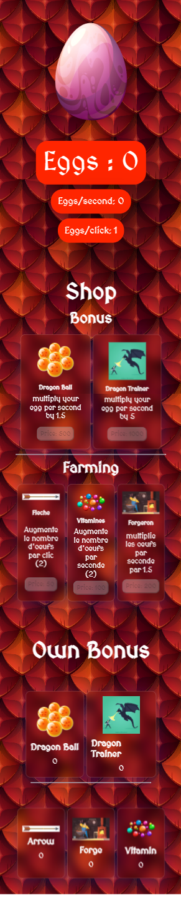
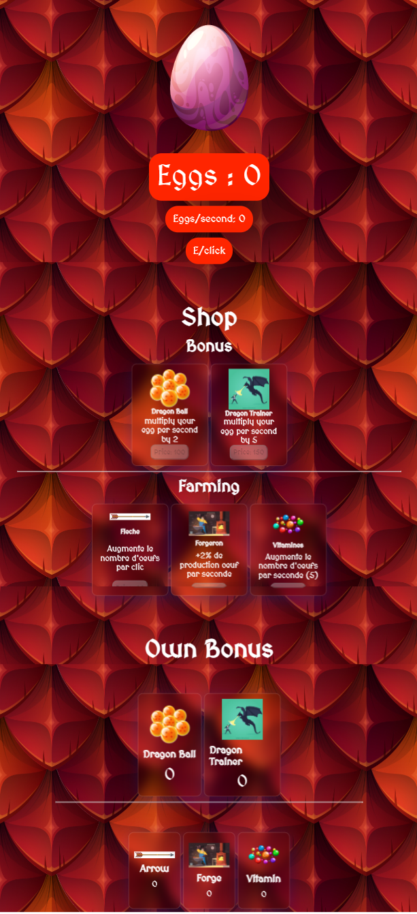

# Dragon Clicker (en cours) 🐉

[Jouez dès maintenant](URL_DU_SITE)

## Équipe

- Justin De Roover 🧙‍♂️ : Gestion de projet / FrontEnd
- Guillaume Dedeurwaerder 👨‍💻 : FrontEnd
- Ayoub Legouirah 🧙‍♂️ : BackEnd
- Burakcan Burcak 👨‍💻 : BackEnd

## Technologies Utilisées 🛠️

Ce projet est construit en utilisant les technologies suivantes :

- HTML
- SASS
- JavaScript
- Vite.js

## Oeuf de Dragon 🥚

### Captures d'Écran

- 
- 
- 

## Boutique 🏪

Explorez la boutique magique pour acheter des améliorations et des ressources pour votre empire.

- Flèche 🏹
- Vitamines 💊
- Forgeron 🔨

## Bonus 🌟

Débloquez des bonus puissants pour améliorer votre empire et devenir un maître des oeufs de dragons !

- Dresseur de Dragon 🐉
- Dragon Ball 🐲

## Bonus Aléatoires 🎲

Obtenez des bonus aléatoires pour des surprises inattendues :

- 🥚 1 : Rapporte des œufs supplémentaires
